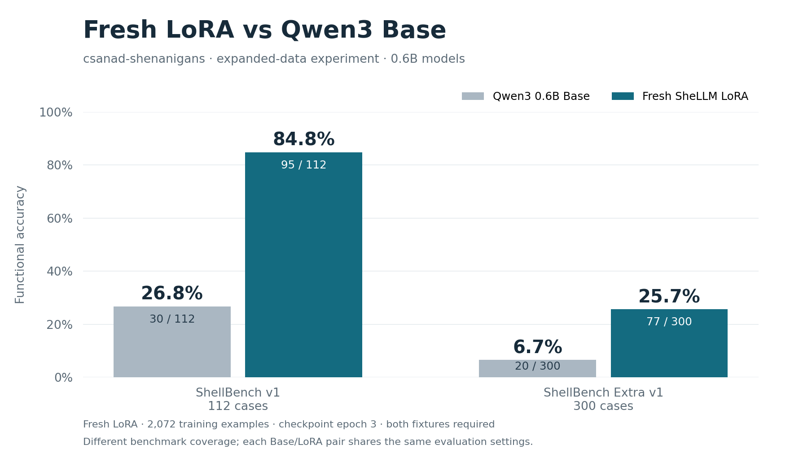

# Fresh LoRA on the csanad-shenanigans data

Date: 2026-10-03 (Europe/Budapest).

## Requested experiment

Fetch the existing remote `csanad-shenanigans` branch, switch to it, train a fresh LoRA on its expanded data, evaluate the final checkpoint on ShellBench v1 and Extra v1, and chart only the new model against Qwen3 0.6B Base on both suites. This is one requested experiment milestone; intermediate epochs remain archived but are excluded from the requested charts.

## Completed checkout and inspection

`git fetch` discovered `origin/csanad-shenanigans`. Switched to the local tracking branch at commit `d311ced` (new utility families and request quality pass). The earlier uncommitted training-explanation document and notebook entry were preserved; the notebook conflict was resolved by keeping both branches' entries.

The branch expanded the existing release named `pilot-v1` in place. It contains 2,444 examples: 2,072 train and 372 validation, 611 scenario groups, and 577 unique command strings across 74 catalog families. Its dataset SHA-256 is `efa33aaf614619ff4f83eaa9ce1ac4a65e53aff431f782269d458e676346d073`. Earlier archived experiments retain their original fingerprints; the shared release name must not be interpreted as identical data. This experiment uses the branch's concrete snapshot without changing its catalogs or rendered examples.

The source/release reproduction check passed, and the request linter reported zero problems across 331 linted groups. The existing sandbox worker was rebuilt to incorporate the branch's binary fixture support. All 611 data scenarios passed both fixtures (1,222 executions). Both benchmarks' references passed (224 original / 600 Extra executions), and 29 training/evaluator regression tests passed in 92.049 seconds, including tokenization of every expanded example and evaluation leakage guards.

The current image is `sha256:66da86ce8a79e4847adee80e063b5bea9e9d4b1d457caec2c62084d9055a4068`. The original worker/oracle changed on this branch, so fresh Base results will be measured alongside the new model on that same image. No benchmark cases or expectations were edited. The data/evaluation validation records were refreshed for this image; their concrete snapshots are copied into the experiment report.

## Training settings and completed results

`configs/training/lora-csanad-2026-10-03.json` retains the previous pilot settings: pinned Qwen Base revision, fresh LoRA rank 8/alpha 16, all seven projection targets, FP16 base, 3 epochs, learning rate 0.0002, seed 42, microbatch 2/effective batch 16, and maximum sequence length 128. The current trainer initializes a new adapter; no earlier LoRA weights or optimizer state are loaded.

Run ID: `2026-10-03-csanad-fresh-lora`. Training completed with 5,046,272 trainable parameters (0.84% of the model), 390 optimizer updates, 6,216 example presentations over three epochs, and zero skipped updates. Runtime was 2,474.9 seconds (41.2 minutes), with 1.4624 GiB peak PyTorch allocation. The longest tokenized example was 73 tokens, below the 128-token cap.

| Saved stage | Optimizer updates | Held-out completion loss |
| --- | --- | --- |
| Before training | 0 | 1.3605 |
| Epoch 1 | 130 | 0.1833 |
| Epoch 2 | 260 | 0.1690 |
| Epoch 3 | 390 | 0.1666 |

These are token prediction losses on the 372 validation rows, not functional command success rates. The final epoch-3 adapter was selected before inspecting benchmark scores. Its SHA-256 is `0196414a5e0869aada9fb4efe944d7ef14a3fea934e409295f6f0ec8bb6be64e`.

Each benchmark measured fresh Base and new-model predictions generated with the same raw prompt, greedy decoding, 64-token limit, and batch size eight, then functionally scored on both of its fixtures under the same current image/evaluator. Extra remained outside training and validation; it was measured only after this training milestone.

`reports/2026-10-03-csanad-fresh-lora/` preserves source provenance (branch/full commit and verification), the expanded dataset manifest and functional validation, Extra reference validation, and the trainer's normal configuration, logs, and per-epoch metadata. Adapter weights stay in ignored `checkpoints/`.

Commands used from WSL with the existing environment:

```bash
export UV_PROJECT_ENVIRONMENT="$HOME/.venvs/shellm-0.6b"
uv run python -m shellm_data build --release pilot-v1 --check
uv run python tools/lint_requests.py
uv run python -m shellbench build
uv run python -m shellm_data validate --release pilot-v1
uv run python -m shellbench validate --suite shellbench-v1
uv run python -m shellbench validate --suite shellbench-extra-v1
uv run python -m unittest tests.test_training_data tests.test_shellbench tests.test_shellbench_extra -v
uv run python -m shellm_training \
  --config configs/training/lora-csanad-2026-10-03.json \
  --run-id 2026-10-03-csanad-fresh-lora
```

## Comparison tooling

Added `tools/evaluate_final.py` to measure one selected checkpoint and Base on both suites, preserving reports under `benchmarks/<suite>/{baseline,epoch-3}/`. It verifies checkpoint hashes, matching decoding settings, suite identity, prediction hashes, and evaluator/image identity before reusing saved results. It updates the combined history index after both comparisons finish.

Added `tools/plot_final_comparison.py` to export the requested combined chart plus one chart per benchmark, all comparing only two models, with PNG/SVG and source CSV. Plotting verifies the archived reports and their settings. All three PNGs were visually inspected: values, counts, labels, legends, and footnotes are readable without clipping.

```bash
uv run python tools/evaluate_final.py --run-id 2026-10-03-csanad-fresh-lora --epoch 3 --batch-size 8
uv run --with matplotlib python tools/plot_final_comparison.py --run-id 2026-10-03-csanad-fresh-lora --epoch 3
```

## Completed functional evaluations

| Benchmark | Model | Functional success | Accuracy | Exact command matches | Syntax passes | Correct raw format |
| --- | --- | --- | --- | --- | --- | --- |
| ShellBench v1 | Qwen3 Base | 30/112 | 26.8% | 14/112 | 108/112 | 111/112 |
| ShellBench v1 | Fresh LoRA, epoch 3 | 95/112 | 84.8% | 82/112 | 112/112 | 112/112 |
| Extra v1 | Qwen3 Base | 20/300 | 6.7% | 10/300 | 281/300 | 265/300 |
| Extra v1 | Fresh LoRA, epoch 3 | 77/300 | 25.7% | 40/300 | 294/300 | 300/300 |

Functional success means the extracted first-line command passed both containers' observable output, status, working directory, and filesystem expectations. Raw formatting and syntax are separate checks. Both LoRA functional counts are also usable counts, because all outputs have the expected format. Extra Base has 17/300 usable outputs: three functionally passing extracted commands have an incorrect raw output format. No generated command was executed on the host.

The two fresh Base scores match the historical scores, providing a regression check after the branch's worker/oracle changes. Within each benchmark, both models share the same suite, image, evaluator, pinned Base revision, and decoding settings. This is a retrospective comparison of the completed adapter, with no Extra-driven checkpoint selection or retraining.

### What we learned

The model substantially outperforms Base on both suites, gaining 58.0 percentage points on the original benchmark and 19.0 on Extra. Correct syntax remains much more common than correct behavior: the new model passes syntax on 294/300 Extra cases but functionality on only 77/300.

Extra's structural breakdown is 26/69 practical cases (37.7%), 33/105 edge cases (31.4%), and 18/126 composition cases (14.3%). The permissions category passes 13/15 (86.7%), versus Base's 4/15 (26.7%). This supports stronger coverage in that category for the expanded model; it does not isolate the contribution of chmod from the other new families. Composition remains a substantial limitation.

The published suites are finite, fixture-based progress measures; two worlds do not prove correctness in arbitrary environments. The branch's utility oracle limitations are documented in [utility command families](utility-command-families.md). Primary development remains based on validation, and Extra stays a periodic milestone snapshot.

## Preserved artifacts

- [Configuration](../configs/training/lora-csanad-2026-10-03.json), [source provenance](../reports/2026-10-03-csanad-fresh-lora/source-provenance.json), [training metadata](../reports/2026-10-03-csanad-fresh-lora/training-metadata.json), and [training log](../reports/2026-10-03-csanad-fresh-lora/training-log.jsonl).
- ShellBench v1: [Base report](../reports/2026-10-03-csanad-fresh-lora/benchmarks/shellbench-v1/baseline/evaluation.json), [new LoRA report](../reports/2026-10-03-csanad-fresh-lora/benchmarks/shellbench-v1/epoch-3/evaluation.json).
- Extra v1: [Base report](../reports/2026-10-03-csanad-fresh-lora/benchmarks/shellbench-extra-v1/baseline/evaluation.json), [new LoRA report](../reports/2026-10-03-csanad-fresh-lora/benchmarks/shellbench-extra-v1/epoch-3/evaluation.json).
- Each evaluation directory preserves `predictions.jsonl` and `generation-metadata.json`; `reports/history.csv` now indexes 13 evaluations. Earlier reports remain unchanged.
- [Combined chart PNG](../reports/2026-10-03-csanad-fresh-lora/charts/final-model-versus-base-both-benchmarks.png) and [SVG](../reports/2026-10-03-csanad-fresh-lora/charts/final-model-versus-base-both-benchmarks.svg).
- [ShellBench v1 PNG](../reports/2026-10-03-csanad-fresh-lora/charts/shellbench-v1-final-versus-base.png) and [SVG](../reports/2026-10-03-csanad-fresh-lora/charts/shellbench-v1-final-versus-base.svg).
- [Extra v1 PNG](../reports/2026-10-03-csanad-fresh-lora/charts/shellbench-extra-v1-final-versus-base.png) and [SVG](../reports/2026-10-03-csanad-fresh-lora/charts/shellbench-extra-v1-final-versus-base.svg).
- [Chart source CSV](../reports/2026-10-03-csanad-fresh-lora/charts/comparison.csv).



The plotted model is solely the new epoch-3 checkpoint; older LoRA epochs are excluded. Checkpoints remain in ignored `checkpoints/2026-10-03-csanad-fresh-lora/epoch-N/`. Git is left on `csanad-shenanigans`; no commit or push was requested.

Final `git diff --check` passed. Relative to the checked-out branch, the trainer/evaluator source, training catalogs/rendered shards, and frozen benchmark cases have no changes. The changed validation JSON files refresh the image/provenance checks for this experiment; archived scores remain preserved.

## Next step

Discuss these results before another training or data milestone. Future changes should be planned and selected primarily against validation coverage, preserving Extra as a broader progress snapshot. No additional training or case-specific tuning is part of this completed experiment.
