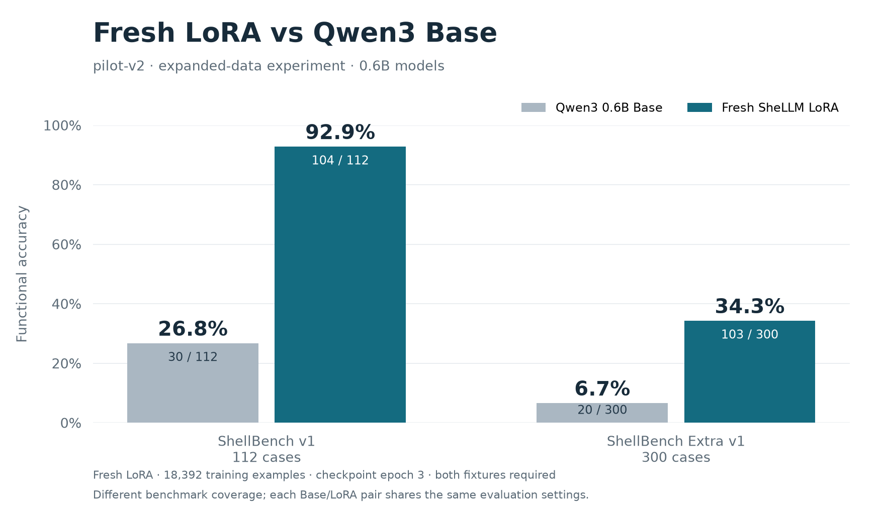

# Fresh LoRA on pilot-v2

Date: 2026-10-10 (Europe/Budapest).

## Requested milestone and status

The user approved the prepared pilot-v2 dataset and requested a fresh adapter, followed by ShellBench v1 and Extra v1 evaluation and the usual Base comparison charts. This training/evaluation/chart sequence is one requested experiment milestone. **Completed: trained from Base, evaluated both frozen suites, and exported and visually checked all three comparison charts.**

Run ID: `2026-10-10-pilot-v2-fresh-lora-expandable`. Git branch: `master`, source commit `528ab8095472dcadf75e88c8676c97cf068dd852`, with the reviewed dataset expansion present as local changes. New source provenance snapshots identify the actual files rather than implying the uncommitted data is in that commit.

## Data and checks

The complete [pilot-v2 release](pilot-v2-coverage-data-expansion.md) contains 18,392 training and 4,392 validation examples, including the preserved parent data. Only pilot-v2 is loaded, avoiding duplicate parent examples. Dataset SHA-256: `d546e6075d539854706eecce78ce0e3667257c067a218722945ddff545265e93`.

The reviewed data passed 8,002 Docker label executions, request separation/lint checks, and tokenizer checks for all 22,784 examples. The current intent validator hash matches the release validation record. The longest example is 86 tokens. CUDA reports an RTX 2060 with 6 GiB, and the verified Docker image remains `sha256:66da86ce8a79e4847adee80e063b5bea9e9d4b1d457caec2c62084d9055a4068`.

## Prespecified training settings

- Base: `Qwen/Qwen3-0.6B-Base`, pinned revision `da87bfb608c14b7cf20ba1ce41287e8de496c0cd`.
- Fresh LoRA rank 8, alpha 16, dropout 0.05 on all seven attention/MLP projections. No previous adapter or optimizer state is loaded.
- Three epochs, learning rate 0.0002, cosine decay, seed 42, FP16 frozen Base/autocast with FP32 adapters/optimizer.
- Microbatch 4, effective batch 16, maximum sequence length 128, gradient clipping 1.0.
- Warmup 90 updates: about 2.6% of the planned 3,450 updates, close to the previous experiment's 10/390 fraction.
- `PYTORCH_ALLOC_CONF=expandable_segments:True`, verified by a successful allocation and the installed PyTorch allocator snapshot before the replacement run. The config records the setting and the trainer checks the launch environment matches it.

The microbatch increases from the prior experiment's two to four. Effective batch size remains unchanged. Batch/dropout and schedule details differ from the previous run; the comparison is not a controlled experiment isolating dataset size alone.

### Interrupted eight-example microbatch attempt

The initial attempt, `2026-10-10-pilot-v2-fresh-lora`, used `lora-pilot-v2-2026-10-10.json` with microbatch eight. Its initial validation took about eight minutes and returned 1.13793 completion loss. GPU-reported memory usage approached 5.9/6 GiB, while peak live PyTorch allocation was only 2.33 GiB. The difference suggests cached/reserved memory or driver pressure; no out-of-memory exception occurred and this is not proof of the cause of slow validation.

The agent chose a smaller microbatch for memory headroom. Four updates (64 example presentations) completed between the last progress check and the interrupt. The run ended with `KeyboardInterrupt`, with its metadata/log/provenance preserved. No epoch checkpoint was saved and none of that adapter's weights are reused. The replacement initializes a completely fresh adapter under a new run ID. Validation logging was added every 100 microbatches; loss/training calculations are unchanged, and the replacement records the new trainer hash.

### Interrupted four-example microbatch attempt

`2026-10-10-pilot-v2-fresh-lora-micro4` used `lora-pilot-v2-2026-10-10-micro4.json` with the default allocator. Initial validation returned 1.13797 loss. Although peak live allocation was only about 1.80 GiB, GPU-reported usage again approached 5.9 GiB and update times slowed considerably. The agent interrupted it at 30 updates (480 presentations), before any epoch checkpoint. Its logs/metadata/provenance are preserved; none of its weights are reused.

A separate tiny allocation successfully verified expandable segments on this installed PyTorch/CUDA/WSL combination. The next attempt starts again from Base, changes the allocator setting, and retains all model/optimizer/data settings of the microbatch-four attempt. The trainer now records reserved memory as well as live peak allocation. These are performance/provenance changes; loss, gradient weighting, optimization and checkpoint selection calculations are unchanged. Driver pressure remains a hypothesis to check against observed memory and throughput.

The final epoch-3 checkpoint is selected before benchmark scores. Epochs one and two are archived but excluded from the requested charts. Validation completion loss is distinct from functional accuracy. The combined validation split retains the parent's weaker separation; the new portion holds out wording and arguments together, not compositions independently.

## Commands

In WSL from the repository root:

```bash
export UV_PROJECT_ENVIRONMENT="$HOME/.venvs/shellm-0.6b"
export PYTORCH_ALLOC_CONF="expandable_segments:True"
uv run python -u -m shellm_training \
  --config configs/training/lora-pilot-v2-2026-10-10-expandable.json \
  --run-id 2026-10-10-pilot-v2-fresh-lora-expandable

# After successful training:
uv run python -u tools/evaluate_final.py \
  --run-id 2026-10-10-pilot-v2-fresh-lora-expandable --epoch 3 --batch-size 8
uv run --with matplotlib python tools/plot_final_comparison.py \
  --run-id 2026-10-10-pilot-v2-fresh-lora-expandable --epoch 3
```

The final comparison tooling validates both suites' references and measures Base plus the new checkpoint under matching settings. Raw completions, extracted commands, format/syntax checks and functional execution scores remain distinct. Generated commands execute only in disposable Docker fixtures. Extra remains outside training/validation and does not select checkpoints or prompt retraining.

The chart tool now derives the experiment subtitle from the dataset release instead of hardcoding the previous branch name. Its footer says functional evaluation without implying the benchmark is blind: v1 has already informed capability coverage decisions. It exports a combined column chart and one chart per benchmark, PNG/SVG, and CSV. Existing chart artifacts are preserved.

## Results and preserved artifacts

### Completed training

| Measurement | Observed result |
| --- | ---: |
| Training loop time, including validation and checkpoint saving, excluding model loading | 7,839.4 seconds (130.7 minutes) |
| Optimizer updates | 3,450 |
| Example presentations | 55,176 |
| Skipped updates | 0 |
| Trainable / total parameters | 5,046,272 / 601,096,192 (0.84%) |
| Peak live PyTorch allocation | 1.824 GiB |
| Peak reserved PyTorch memory | 2.010 GiB |
| Initial validation completion loss | 1.137967 |
| Epoch 1 validation completion loss | 0.030199 |
| Epoch 2 validation completion loss | 0.019838 |
| Epoch 3 validation completion loss | 0.019458 |

All three epochs were saved and the adapter weights changed. The selected epoch-3 adapter SHA-256 is `11e702fb8d699cf88244d542bfab234a33588cfb0b4e9685239d78a5916cef3c`. The final run completed with exit code zero. It sustained roughly 2.1 seconds per optimizer update and reserved about 2.0 GiB during training. This is observed improvement in memory usage and throughput relative to the interrupted attempts; it does not prove which allocator/driver interaction caused their slowdowns. No interrupted weights were loaded.

### Completed benchmark evaluation

All 112 v1 and 300 Extra v1 reference commands passed independent checks on both fixtures: 824 reference executions in the validation stage. Neither suite's cases, references, fixtures, or evaluator were changed. The Extra audit found zero training/validation request overlap, zero original-benchmark request overlap, and zero exact existing command-label overlap. Its refreshed reference validation record is copied into this experiment's report directory.

Base and epoch three use the same pinned model/tokenizer, raw `Request: ...\nCommand:` prompt, greedy decoding, FP16, batch size eight, a 64-token generation limit, and newline/EOS stopping. The evaluation runner verified benchmark, evaluator, Docker image, prediction and adapter fingerprints. Both Base measurements reproduce the earlier scores. Evaluation and chart commands exited successfully.

| Benchmark | Model | Functional | Usable | Format | Syntax | Exact string |
| --- | --- | ---: | ---: | ---: | ---: | ---: |
| ShellBench v1 (112) | Qwen3 Base | 30 (26.8%) | 30 | 111 | 108 | 14 |
| ShellBench v1 (112) | Fresh pilot-v2 LoRA | **104 (92.9%)** | 104 | 112 | 112 | 89 |
| Extra v1 (300) | Qwen3 Base | 20 (6.7%) | 17 | 265 | 281 | 10 |
| Extra v1 (300) | Fresh pilot-v2 LoRA | **103 (34.3%)** | 103 | 300 | 292 | 53 |

Functional success means the extracted command passed both disposable fixtures' output, exit-status, working-directory and filesystem checks. Raw completion format and command syntax are separate measurements. Usable means both functional and correctly formatted; three Base Extra completions are functionally correct after extraction but not correctly formatted. Every new LoRA completion passed the format check. Eight Extra commands failed syntax checks. Printed/generated commands were actually executed for these functional scores; earlier generation alone was not described as validation.

### Historical progress and remaining limitations

The prior [csanad experiment](csanad-expanded-data-lora-experiment.md) used 2,072 training examples. Comparing its final adapter with this run under matching benchmark/evaluator/image fingerprints:

| Benchmark | Previous LoRA | New LoRA | Net change | Newly passing / regressions |
| --- | ---: | ---: | ---: | ---: |
| ShellBench v1 | 95/112 (84.8%) | 104/112 (92.9%) | +9 cases, +8.0 percentage points | 11 / 2 |
| Extra v1 | 77/300 (25.7%) | 103/300 (34.3%) | +26 cases, +8.7 percentage points | 39 / 13 |

The aggregate gain includes regressions; the new adapter is not better on every request. `comparison-to-previous.json` preserves paired counts and aggregate coverage/family scores. The historical comparison is not a controlled test of dataset size alone: training data, schedule length, warmup and microbatch changed. The requested charts show only fresh Base and the new final adapter.

On v1, all 29 argument, 18 basic, seven informal and five paraphrase cases passed. Quoted arguments passed 22/25; compositions passed 7/11; options passed 15/16. The eight remaining failures include interpreting a filename with spaces as separate arguments, missing requested options, and incorrect compositions. Syntax success does not establish semantic correctness.

Extra remains a long-term measurement outside the training and validation splits. Its aggregate results show substantial room for improvement: pipeline coverage is 2/32 and multi-step coverage is 0/18. No Extra requests or labels were added to training and its score did not select the checkpoint or trigger further training. These counts describe standing on the frozen suite, not a new training specification.

V1 is a diagnostic benchmark whose aggregate gaps informed the preceding data expansion, so it is not a blind measure of generalization. Zero literal overlap does not establish semantic independence. This release's validation wording and argument holdouts share authored templates with training and do not independently hold out compositions; low validation loss therefore does not imply near-perfect real-world translation. Both benchmarks check finite Linux/Docker fixtures, not arbitrary machines, environments or every possible equivalent command.

### Artifact locations

Training and evaluation reports are under [the run directory](../reports/2026-10-10-pilot-v2-fresh-lora-expandable/):

- `training-metadata.json`, `training-log.jsonl`, and `epoch-{1,2,3}-metadata.json`: parameters, losses, counters, memory and adapter fingerprints.
- `source-provenance.json`, `source-snapshot/shellm_training/`, and `dataset-{manifest,validation,quality}.json`: actual source/data checks for the dirty working tree. The trainer digest hashes its entry point plus `data.py` together.
- `benchmarks/{shellbench-v1,shellbench-extra-v1}/{baseline,epoch-3}/`: raw predictions, generation settings and complete per-case functional evaluation JSON.
- `evaluation-provenance.json` and `shellbench-extra-v1-reference-validation.json`: evaluation/tool hashes and reference separation/check records. The analysis provenance records the final plotting footer change separately from the earlier training-time source snapshot.
- `comparison-to-previous.json`: previous/new summaries and paired functional gains/regressions.
- `training-console.log` and `evaluation-console.log`: completed console logs. The two interrupted attempts retain their own logs and failed-run metadata under their separate report directories.
- `charts/final-model-versus-base-both-benchmarks.{png,svg}`: combined column chart, 0–100% axis, no earlier epochs.
- `charts/{shellbench-v1,shellbench-extra-v1}-final-versus-base.{png,svg}`: individual benchmark charts.
- `charts/comparison.csv`: four chart data rows. All three PNGs were visually inspected; labels and footers are readable without clipping.



`reports/history.csv` now contains 17 evaluation rows, preserving the earlier runs and adding these four comparisons. Model weights remain in ignored `checkpoints/2026-10-10-pilot-v2-fresh-lora-expandable/epoch-{1,2,3}/`. Console logs used persistent repository `.cache/`, not ephemeral WSL `/tmp`, and were copied into reports after each process finished. No Git commit, push, or model publication was performed.

Final verification: `uv run python -m shellm_data build --release pilot-v2 --check` passed after training, confirming the approved rendered data still matches its catalogs and recorded hash. Adapter/trainer fingerprint and counter checks passed. `git diff --check` found no whitespace errors; the only tracked evaluation change is the refreshed Extra reference-validation record. Earlier releases, benchmark cases, and historical experiment artifacts remain unchanged.

## Next step

Discuss this completed experiment before starting another milestone. A proposed next development step is an independent composition/quoting validation design, with its examples and functional oracles reviewed before any further data or training change. Extra should continue to measure long-term progress rather than supply training labels. No next experiment has been started.
