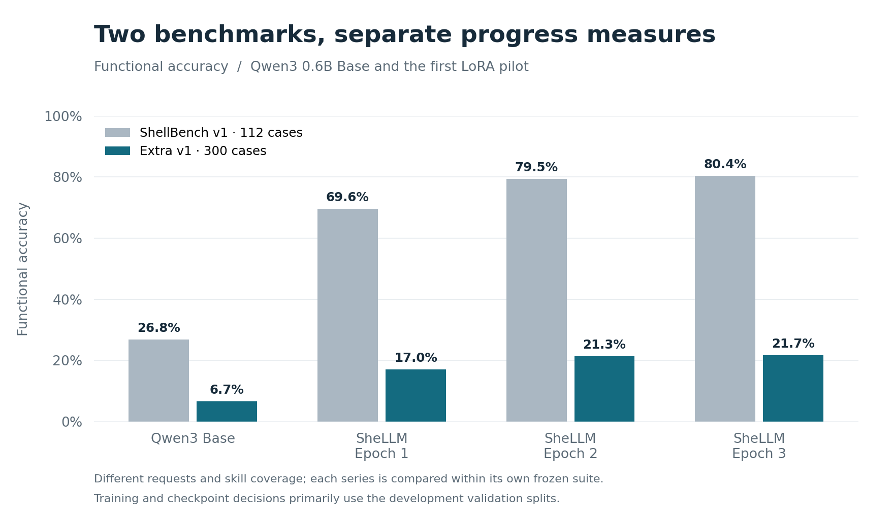

# ShellBench Extra v1: separate long-term evaluation

Date: 2026-10-02 (Europe/Budapest).

## Purpose and role

Build a stronger progress measure toward the desired final translator, independent of the pilot training/validation release. Development should primarily use validation splits. Extra is an explicit periodic benchmark; it is not a validation split, a source of training examples, or an automatic training/early-stopping gate.

## Completed construction

Authored 300 new request/reference/expectation triples under `eval/shellbench-extra-v1/`, covering 20 categories with 15 cases each. New filesystem worlds and a separate Python expectation engine support precise text processing, paths/quoting, regular versus symbolic files, recursive exclusions, compound conditions, state changes, permissions, links, pipelines, and branching behavior. No training catalog or training intent renderer is used to create these cases.

The suite has 69 practical, 105 edge, and 126 composition cases. Structural difficulty tags are declared before model measurements, not assigned after seeing scores. The reference commands fit the existing 64-token output budget; the longest needs 42 tokens including EOS.

All 300 references passed the independent oracle in both worlds (600 executions). The audit found zero normalized request overlap and zero identical reference commands with both the training/validation release and original ShellBench. Existing dataset fingerprints are saved in `validation.json`, and no data release or split was edited. Common Linux operations intentionally remain shared; novelty of every latent skill is not claimed.

## Implementation

- `shellbench/suites.py` selects `shellbench-v1` or `shellbench-extra-v1`; existing commands default to the original suite.
- `shellbench/extra_fixtures.py`, `extra_oracle.py`, and `extra_audit.py` provide independent environments, intended outputs/state, frozen-version checks, and separation checks.
- `shellbench generate/evaluate/validate --suite shellbench-extra-v1` records the actual suite and fingerprint. Scoring rejects cross-suite predictions. Historical legacy pilot metadata remains supported with ID/request checks.
- `shellm_data/core.py` guards future releases against all reserved evaluation requests and Extra's concrete reference labels. Original released JSONL examples are unchanged.
- `tools/evaluate_extra.py` explicitly measures a completed training run and its pinned frozen base, protecting existing predictions/results.
- `tools/report_history.py` now includes suite and benchmark-run columns so charts can keep different tests separate.
- `tools/plot_extra.py` exports Extra-only and grouped original/Extra PNG/SVG charts with source CSV. It uses Matplotlib in the bundled plotting runtime, not new training dependencies.

The existing sandbox limits and Linux tools are reused. Candidate commands do not execute on the host. Reference results may use the ignored cache, keyed by image/cases/fixtures; all cached observations are checked again by the independent oracle before scoring.

### Worker repair during measurement

The initial worker scored Base and epoch 1, then aborted during epoch 2: a generated command created a directory with no read permission, and cleanup could not reset the second fixture. This was an evaluator infrastructure failure, not a completed model score. The worker now temporarily grants its own fixture paths read/traversal access while taking snapshots, records original modes, restores those modes, and restores directory access before cleanup. It never follows symbolic links for cleanup. A regression test confirms nested mode-000 directories/files are fully recorded and subsequent fixtures reset successfully.

The image was rebuilt, all references revalidated, and all four model reports rescored under the same corrected image/evaluator. The earlier Base/epoch-1 reports are preserved as `evaluation-initial-worker.json`, with the earlier reference validation in `validation-initial-worker.json`. Existing model predictions were reused; no benchmark case or trained adapter was changed.

## Verification

The final full test run passed **29 methods in 135.9 seconds** after the worker repair (`uv run python -m unittest discover -s tests -v`). It includes 40 equivalent/wrong-command subcases spanning all 20 Extra categories, original benchmark regression checks, and checks for file types, pruning, collateral deletion, request/command leakage, fixture variation, numeric output labels, and restrictive permissions/reset behavior. Training release reproduction and tokenization checks also passed. A separate real-model check confirmed matching batched/serial greedy completions on four unequal-length requests, including EOS/newline trimming.

Rerunning `tools/evaluate_extra.py` with the same report ID successfully reused all four completed snapshots after checking their suite, model/adapter, batch, prediction, evaluator, and image fingerprints. It regenerated the nine-record history index without replacing predictions or scores. `git diff --check` passed; the original data release, original cases, and archived pilot reports have no changes.

## Initial measurements

The frozen Base model and all three saved adapters from `2026-10-01-lora-pilot-v1` were measured without retraining. All Extra measurements use the same pinned revision, raw prompt, greedy decoding, 64-token cap, and batch size eight. All four final reports share the corrected image and evaluator fingerprint. The old pilot chart retains its original archived measurements; inference timing between the old serial and new batched runs is not comparable.

| Model | Extra functional success | Extra accuracy | Extra exact command matches | Original ShellBench v1 accuracy |
| --- | --- | --- | --- | --- |
| Qwen3 0.6B Base | 20/300 | 6.7% | 10/300 | 26.8% (30/112) |
| LoRA epoch 1 | 51/300 | 17.0% | 27/300 | 69.6% (78/112) |
| LoRA epoch 2 | 64/300 | 21.3% | 35/300 | 79.5% (89/112) |
| LoRA epoch 3 | 65/300 | 21.7% | 35/300 | 80.4% (90/112) |

Functional success refers to the extracted first-line command succeeding in both containers with the expected observable output/state. Raw output format is measured separately: Base had 265/300 correctly formatted outputs and 17/300 results that were both formatted and functional; each LoRA epoch had 300/300 correctly formatted outputs, so its usable count equals its functional count. Syntax passed for 281, 286, 287, and 287 commands respectively. Syntax alone therefore substantially overstates task success.

Epoch 3 passed 23/69 practical cases (33.3%), 28/105 edge cases (26.7%), and 14/126 composition cases (11.1%). The pilot improved overall Extra accuracy by 15.0 percentage points over Base, with one additional success between epochs 2 and 3. These observations establish a starting curve with considerable room for broader capability improvement; they do not select new training examples or change checkpoint choices.

### Saved artifacts

- [Base evaluation](../reports/2026-10-02-shellbench-extra-v1/baseline/evaluation.json), [epoch 1](../reports/2026-10-02-shellbench-extra-v1/epoch-1/evaluation.json), [epoch 2](../reports/2026-10-02-shellbench-extra-v1/epoch-2/evaluation.json), [epoch 3](../reports/2026-10-02-shellbench-extra-v1/epoch-3/evaluation.json). Each directory also contains the raw predictions and generation metadata.
- [Chart source CSV](../reports/2026-10-02-shellbench-extra-v1/charts/comparison.csv) and [combined history CSV](../reports/history.csv). History now contains nine evaluation records; earlier pilot reports were preserved.
- [Extra-only PNG](../reports/2026-10-02-shellbench-extra-v1/charts/shellbench-extra-v1-functional-accuracy.png) and [SVG](../reports/2026-10-02-shellbench-extra-v1/charts/shellbench-extra-v1-functional-accuracy.svg).
- [Grouped comparison PNG](../reports/2026-10-02-shellbench-extra-v1/charts/shellbench-v1-and-extra-v1-comparison.png) and [SVG](../reports/2026-10-02-shellbench-extra-v1/charts/shellbench-v1-and-extra-v1-comparison.svg). Both PNGs were visually inspected for labels, values, legends, and clipping.

## Repeat and inspect

See [the benchmark README](../eval/shellbench-extra-v1/README.md) for commands, case format, limits, and intended protocol. Read [cases](../eval/shellbench-extra-v1/cases.jsonl), [manifest](../eval/shellbench-extra-v1/manifest.json), and [reference validation](../eval/shellbench-extra-v1/validation.json). Initial model reports live in `reports/2026-10-02-shellbench-extra-v1/`.

## Next step and limits

Keep primary development and checkpoint choices focused on validation. Use Extra only for larger milestone snapshots, preserving its cases. This broadens the measured skill domain, so a lower score than the original suite reflects a different benchmark; it is not directly a model regression. Exact overlap checks cannot prove semantic independence, and two fixture variants cannot establish universal correctness. A final untouched test set is still a separate future requirement.
